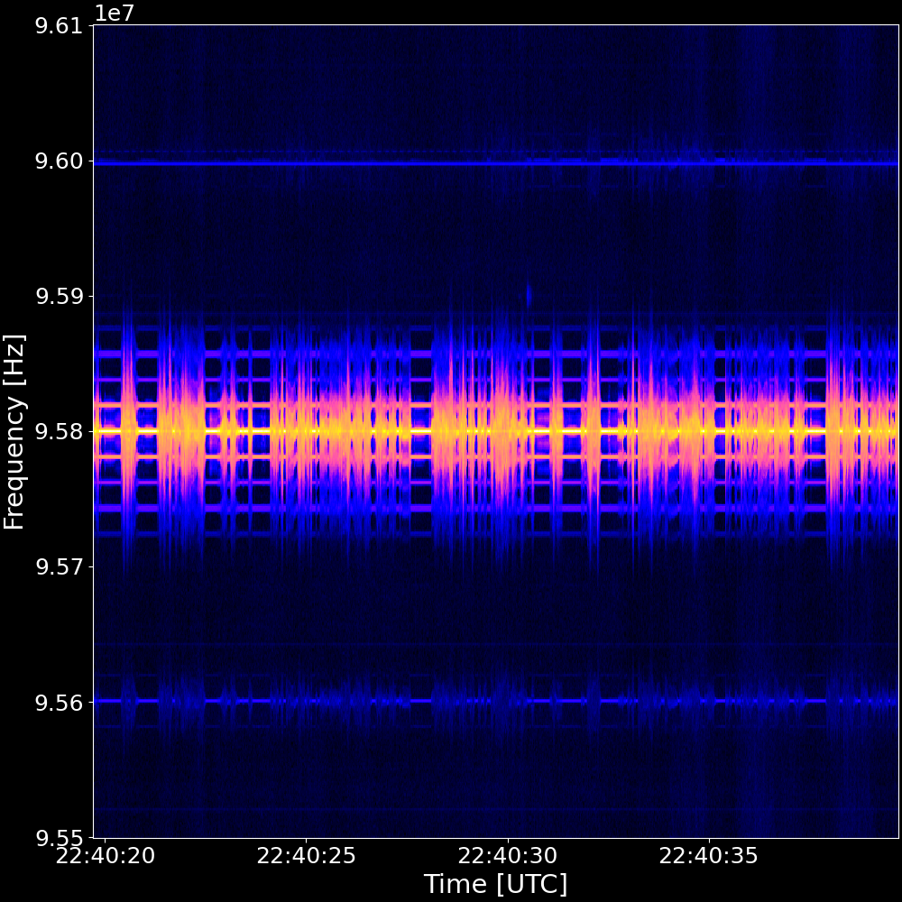

<h1 align="center">
  SPECTRE: Process, Explore and Capture Transient Radio Emissions
</h1>

<div align="center">
  
  
  
</div>


## Overview

📢 **This project is under active development. Contributors welcome!** 📢

`spectre` is a receiver-agnostic program for recording and visualising radio spectrograms. Powered by [GNU Radio](https://www.gnuradio.org/).


### **Features**
- 💻 Intuitive CLI tool  
- 🐳 Simple installation with Docker
- 🛰️ Wide receiver support  
- 💾 Live recording of radio spectrograms and I/Q data  
- ⚙️ Flexible, configurable data capture   
- 🔧 Developer-friendly and extensible

## Supported Receivers

Our abstract framework can support any receiver with a source block in GNU Radio. If you have a receiver that isn't supported, reach out, and we can look into adding support for it!

### **Currently Supported Receivers**
- [RSP1A (from SDRPlay)](https://www.sdrplay.com/rsp1a/)  
- [RSPduo (from SDRPlay)](https://www.sdrplay.com/rspduo/)  
- [USRP B200mini (from Ettus Research)](https://www.ettus.com/all-products/usrp-b200mini/)

### **Planned Future Support**
- RSP1, RSP1B, RSP2, RSPdx 
- Any USRP SDR 
- RTLSDR, AirspyHF, BladeRF, HackRF, LimeSDR, PLUTO (via [`Soapy`](https://wiki.gnuradio.org/index.php/Soapy))  

**⚠️ Note:**  
SDRPlay clones (i.e., unofficially produced copies of SDRPlay receivers) will likely not work with spectre as they are not compatible with the official SDRPlay API.  
## Supported Platforms
`spectre` is expected to be compatible with most Linux distributions.

The following operating systems and architectures have been verified:   
- **ThinkPad P1G5** running:
  - Ubuntu 22.04.3  
- **Raspberry Pi 4 Model B** running:
  - Ubuntu Desktop  
  - Raspberry Pi OS  
  - Raspberry Pi OS Lite  

macOS compatibility will be explored in the future.

## Quick Start

### **Prerequisites**
To get going, you'll need the following installed on your machine:  
| Prerequisite      | How to Install | Do I Already Have It? |
|------------------|---------------|-----------------------|
| **Docker Engine** | [Install Docker Engine](https://docs.docker.com/engine/install/) | Run `docker --version` |
| **Git**          | [Getting Started - Installing Git](https://git-scm.com/book/en/v2/Getting-Started-Installing-Git) | Run `git --version` |

### **Initial setup**
1. **Clone the repository**  
   Clone the `spectre` GitHub repository and navigate to its root directory:    
   ```bash
   git clone https://github.com/jcfitzpatrick12/spectre.git && \
   cd spectre
   ```
   
2. **Set environment variables**  
   Set the `SPECTRE_DATA_DIR_PATH` environment variable, which specifies which directory to store data files generated by the program:  
   ```bash
   export SPECTRE_DATA_DIR_PATH="$(pwd)/.spectre-data" && \
   echo "export SPECTRE_DATA_DIR_PATH=\"$SPECTRE_DATA_DIR_PATH\"" >> ~/.bashrc
   ```

### **Starting the spectre-server**
The `spectre-server` container must be running to handle `spectre-cli` requests. The following commands assume your current working directory is the root of this repository (wherever you cloned it).


1. **Build the Docker image**  
   Build the docker image, which may take a couple of minutes to complete:  
   ```bash
   docker build --tag spectre-server --target runtime backend
   ```

2. **Run the `spectre-server` container**  
   First ensuring any receivers are plugged in, run the container:  
   ```bash
   docker run --rm \
              --name spectre-server \
              --publish 127.0.0.1:5000:5000 \
              --volume $SPECTRE_DATA_DIR_PATH:/app/.spectre-data \
              --volume /dev/shm:/dev/shm \
              --device=/dev/bus/usb \
              --detach \
              spectre-server
   ```
   You can omit the `--detach` flag if you are happy with it running in the foreground.

3. **Verify the container is running**  
   Check the `spectre-server` is running with:  
   ```bash
   docker container list
   ```

4. **Stop the container**  
   To stop the `spectre-server`, run:  
   ```bash
   docker kill spectre-server
   ```

Any data stored in the directory specified by the `SPECTRE_DATA_DIR_PATH` environment variable will persist beyond the container's lifecycle. For more information on persistent storage in containers, refer to [Docker's official documentation](https://docs.docker.com/engine/storage/).


### **Checking your receiver is detected**  
If you have a physical receiver connected, it's a good idea to verify that the `spectre-server` can detect it.

- For SDRplay receivers, run:  
   ```bash
   docker exec spectre-server sdrplay_find_devices
   ```

- For USRP receivers, run:  
   ```bash
   docker exec spectre-server uhd_find_devices
   ```

If this is the first time you're running the container since plugging in the device, it may not be detected. Ensure the receiver is still connected, then try stopping and restarting the container.


### **Running the spectre-cli**
Run these steps after setting up and starting the `spectre-server`. The following commands assume your present working directory is the root of this repository (wherever you cloned it on your system).

1. **Activate a Python virtual environment**  
   Create and activate a Python virtual environment: 
   ```bash
   python3 -m venv ./.venv && \
   . ./.venv/bin/activate
   ```


2. **Install dependencies**  
   Install the required dependencies:  
   ```bash
   pip install ./cli
   ```

3. **Ready-to-go: try the `spectre-cli`**  
   Verify the CLI is operational:  
   ```bash
   spectre --help
   ```

Notably, the CLI commands will only work when the virtual environment is activated.


## **Quick Start for Developers**
1. **Build the Docker image**  
   Use the development stage as a target to build the development image:    
   ```bash
   docker build --tag spectre-server --target development backend
   ```

2. **Run the `spectre-dev-server` container**   
   Run the following command:  
   ```bash
   docker run --rm \
              --name spectre-dev-server \
              --publish 127.0.0.1:5000:5000 \
              --volume $SPECTRE_DATA_DIR_PATH:/app/.spectre-data \
              --volume /dev/shm:/dev/shm \
              --device=/dev/bus/usb \
              --env DISPLAY=$DISPLAY \
              --volume /tmp/.X11-unix:/tmp/.X11-unix \
              --interactive \
              --tty \
              spectre-dev-server \
              /bin/bash
   ```

You can then use [dev-containers](https://code.visualstudio.com/docs/devcontainers/containers) to work on the latest versions of `spectre-core` and `spectre`.

## Contributing
This repository is in active development. If you are interested, feel free to contact  jcfitzpatrick12@gmail.com :)
