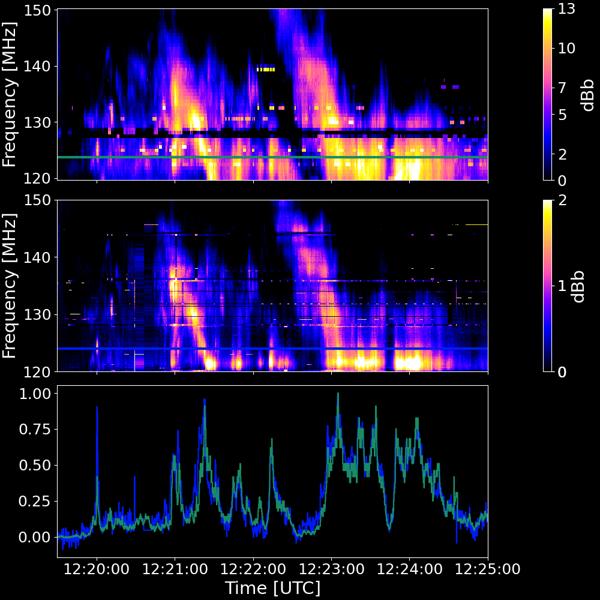

# **SPECTRE: Process, Explore and Capture Transient Radio Emissions**

## Overview

📢 **This project is under active development. Contributors welcome!** 📢

`spectre` is a receiver-agnostic program for recording and visualising radio spectrograms. Powered by [GNU Radio](https://www.gnuradio.org/).

### **Features**
- 💻 Intuitive CLI tool  
- 🐳 Simple installation with Docker
- 🛰️ Wide receiver support  
- 💾 Live recording of radio spectrograms and I/Q data  
- ⚙️ Flexible, configurable data capture   
- 🔧 Developer-friendly and extensible


## Solar Radio Observations ☀️
As a glimpse of what `spectre` can do, here are some recorded radio observations of the huge X9.0 solar flare which occurred on October 3rd 2024. The figure below compares a `spectre` spectrogram (second panel) captured in the West End of Glasgow, to that observed by a [CALLISTO](https://e-callisto.org/) spectrometer stationed in Egypt, Alexandria (top panel).




## Supported Receivers

Initial support is focused on the SDRplay RSP* series via [`gr-sdrplay3`](https://github.com/fventuri/gr-sdrplay3). A wide range of receiver support is planned.

### **Current Supported Receivers**
- [RSP1A (from SDRPlay)](https://www.sdrplay.com/rsp1a/)  
- [RSPduo (from SDRPlay)](https://www.sdrplay.com/rspduo/)  

### **Planned Future Support**
The framework is in place to integrate the following receivers:
- RSP1, RSP1B, RSP2, RSPdx (via [`gr-sdrplay3`](https://github.com/fventuri/gr-sdrplay3))  
- USRP SDRs (e.g., the [b200-mini](https://www.ettus.com/all-products/usrp-b200mini/))  
- RTLSDR, AirspyHF, BladeRF, HackRF, LimeSDR, PLUTO (via [`Soapy`](https://wiki.gnuradio.org/index.php/Soapy))  

**⚠️ Note:**  
SDRPlay clones (i.e., unofficially produced copies of SDRPlay receivers) will likely not work with spectre as they are not compatible with the official SDRPlay API.  


## Supported Platforms
`spectre` is expected to be compatible with most Linux distributions.

The following operating systems and architectures have been verified:   
- **ThinkPad P1G5** running:
  - Ubuntu 22.04.3  
- **Raspberry Pi 4 Model B** running:
  - Ubuntu Desktop  
  - Raspberry Pi OS  
  - Raspberry Pi OS Lite  

macOS compatibility will be explored in the future.


## Quick Start

### **Prerequisites**
To get going, you'll need the following installed on your machine:  
| Prerequisite      | How to Install | Do I Already Have It? |
|------------------|---------------|-----------------------|
| **Docker Engine** | [Install Docker Engine](https://docs.docker.com/engine/install/) | Run docker --version |
| **Git**          | [Getting Started - Installing Git](https://git-scm.com/book/en/v2/Getting-Started-Installing-Git) | Run git --version |


### **Initial setup**
1. **Clone the repository**  
   Clone the `spectre` GitHub repository and navigate to its root directory:    
   ```bash
   git clone https://github.com/jcfitzpatrick12/spectre.git && \
   cd spectre
   ```


2. **Set environment variables**  
   Set the `SPECTRE_DATA_DIR_PATH` environment variable, which specifies which directory to store data files generated by the program:  
   ```bash
   export SPECTRE_DATA_DIR_PATH="$(pwd)/.spectre-data" && \
   echo "export SPECTRE_DATA_DIR_PATH=\"$SPECTRE_DATA_DIR_PATH\"" >> ~/.bashrc
   ```


### **Starting the spectre-server**
The `spectre-server` container must be running to handle `spectre-cli` requests. The following commands assume your current working directory is the root of this repository (wherever you cloned it).


1. **Build the Docker image**  
   Build the docker image, which may take a couple of minutes to complete:  
   ```bash
   docker build --tag spectre-server --progress plain backend --target runtime 
   ```

2. **Identify the USB device**  
   Before starting the `spectre-server` container, determine the correct USB device path. Ensure your hardware device is connected to a USB port, then run:  
   ```bash
   lsusb
   ```
   This will list all connected USB devices. Locate your device in the output and **note the bus and device number**, as you will need them in the next step.

3. **Run the `spectre-server` container**  
   Run the following command, replacing `BUS_NUMBER` and `DEVICE_NUMBER` with the values from the previous step:  
   ```bash
   docker run --rm \
              --name spectre-server \
              --publish 127.0.0.1:5000:5000 \
              --volume $SPECTRE_DATA_DIR_PATH:/app/.spectre-data \
              --volume /dev/shm:/dev/shm \
              --detach \
              --device=/dev/bus/usb/BUS_NUMBER/DEVICE_NUMBER \
              spectre-server
   ```
   **Example:**  
   If `lsusb` outputs:
   ```
   Bus 002 Device 006: ID 2500:0021 Ettus Research LLC USRP B200-mini
   ```
   Then the flag would be:
   ```bash
   --device=/dev/bus/usb/002/006
   ```

4. **Verify the container is running**  
   Check the `spectre-server` is running with:  
   ```bash
   docker container list
   ```

5. **Stop the container**  
   To stop the `spectre-server`, run:  
   ```bash
   docker kill spectre-server
   ```

Any data stored in the directory specified by the `SPECTRE_DATA_DIR_PATH` environment variable will persist beyond the container's lifecycle. For more information on persistent storage in containers, refer to [Docker's official documentation](https://docs.docker.com/engine/storage/).

### **Running the spectre-cli**
Run these steps after setting up and starting the `spectre-server`. The following commands assume your present working directory is the root of this repository (wherever you cloned it on your system).

1. **Activate a Python virtual environment**  
   Create then activate a Python virtual environment: 
   ```bash
   python3 -m venv ./.venv && \
   . ./.venv/bin/activate
   ```


2. **Install dependencies**  
   Install the required dependencies:  
   ```bash
   pip install .
   ```


3. **Ready-to-go: try the `spectre-cli`**  
   Verify the CLI is operational:  
   ```bash
   spectre --help
   ```

Notably, the CLI commands will only work when the virtual environment is activated.


## **Quick Start for Developers**
1. **Build the Docker image**  
   Use the development stage as a target to build the development image:    
   ```bash
   docker build --tag spectre-dev-server --progress plain backend --target development
   ```

2. **Run the `spectre-dev-server` container**   
   Run the following command, replacing `BUS_NUMBER` and `DEVICE_NUMBER` with the values according to the USB
   device you would like to mount:  
   ```bash
   docker run --rm \
              --name spectre-dev-server \
              --publish 127.0.0.1:5000:5000 \
              --volume $SPECTRE_DATA_DIR_PATH:/app/.spectre-data \
              --volume /dev/shm:/dev/shm \
              --device=/dev/bus/usb/BUS_NUMBER/DEVICE_NUMBER \
              --interactive \
              --tty \
              --env DISPLAY=$DISPLAY \
              --volume /tmp/.X11-unix:/tmp/.X11-unix \
              spectre-dev-server \
              /bin/bash
   ```

You can then use [dev-containers](https://code.visualstudio.com/docs/devcontainers/containers) to work on the latest versions of `spectre-core` and `spectre`. If you are using SDRPlay devices, you will need to manually start the API in the background. From inside the container:  

```bash
/opt/sdrplay_api/sdrplay_apiService &
```

## Contributing
This repository is in active development. If you are interested, feel free to contact  jcfitzpatrick12@gmail.com :)
