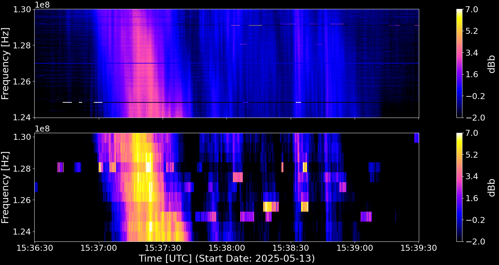

<h1 align="center">
  Spectre: Process, Explore and Capture Transient Radio Emissions
</h1>

<div align="center">
  
  
  
</div>

<div align="center">

  

</div>


## Overview

📢 **This project is under active development, expect breaking changes. Contributors welcome!** 📢

_Spectre_ is a receiver-agnostic program for recording and visualising radio spectrograms. Powered by [GNU Radio](https://www.gnuradio.org/).


### **Features**
- 💻 Intuitive CLI tool
- 🐳 Simple installation with Docker
- 🛰️ Wide receiver support  
- 💾 Live recording of radio spectrograms and I/Q data  
- ⚙️ Flexible, configurable data capture
- ✏️ Services exposed with a discoverable RESTful API
- 🔧 Developer-friendly and extensible


### **Demo**
Capture data from SDRs, simply.

1. **Create a capture config**:  
   Create a new configuration file to collect data from the SDRplay RSP1A receiver at a fixed center frequency:  
   ```bash
   spectre create capture-config --receiver rsp1a \
                                 --mode fixed_center_frequency \
                                 --tag rsp1a-example
   ```
   
2. **Capture data**:  
   Start streaming I/Q samples from the receiver, and automatically post process the data into radio spectrograms:  
   ```bash
   spectre start session --tag rsp1a-example --seconds 30
   ```
   
## Supported Receivers

Our abstract framework can support any receiver with a source block in GNU Radio. If you have a receiver that isn't supported, reach out, and we can look into adding support for it!

### **Currently Supported Receivers**
- [RSP1A (from SDRplay)](https://www.sdrplay.com/rsp1a/)  
- [RSPduo (from SDRplay)](https://www.sdrplay.com/rspduo/)  
- [USRP B200mini (from Ettus Research)](https://www.ettus.com/all-products/usrp-b200mini/)

### **Planned Future Support**
- RSP1, RSP1B, RSP2, RSPdx 
- Any USRP SDR 
- RTLSDR, AirspyHF, BladeRF, HackRF, LimeSDR, PLUTO (via [`Soapy`](https://wiki.gnuradio.org/index.php/Soapy))  

**⚠️ Note:**  
SDRplay clones (i.e., unofficially produced copies of SDRplay receivers) will likely not work with spectre as they are not compatible with the official SDRplay API.  

## Supported Platforms

`spectre` is expected to be compatible with most Linux distributions.

The following platforms have been verified:

- **x86_64**
  - Ubuntu 22.04.3 LTS
- **arm64**
  - Ubuntu Desktop (22.04)
  - Raspberry Pi OS (Desktop and Lite)


macOS compatibility will be explored in the future.

## Quick Start

### **Prerequisites**
To get going, you'll need the following installed on your machine:  
| Prerequisite | Do I Already Have It? |
|--------------|-----------------------|
| [**Docker Engine**](https://docs.docker.com/engine/install/) | Run `docker --version` |
| [**Docker Compose**](https://docs.docker.com/compose/) | Run `docker compose --help` |
| [**Git**](https://git-scm.com/book/en/v2/Getting-Started-Installing-Git) | Run `git --version` |

### **Getting started**

1. **Clone the repository**  
   Clone the `spectre` GitHub repository and navigate to its root directory:  
   ```bash
   git clone https://github.com/jcfitzpatrick12/spectre.git && cd spectre
   ```

2. **Configure your host**  
   Set up targeted USB permissions for the `spectre` application, and initialise environment variables, with sensible defaults:  
   ```bash
   chmod +x setup.sh && sudo ./setup.sh
   ```
   This is __required__ to run the `spectre-server` as a non-root user, which is the default behaviour.

3. **Start the containers**  
   Ensure any receivers are connected, then create and run the containers:  
   ```bash
   docker compose up
   ```

4. **Create an alias for the CLI**  
   In a new terminal tab, set up the following alias:    
   ```bash
   alias spectre='docker exec spectre-cli spectre'
   ```
   This lets you run `spectre-cli` commands as if they were executed directly on the host.


4. **Good to go!**  
   Verify everything is up and running with:    
   ```bash
   spectre --help
   ```
   
### **Check your receiver is detected**  
If you have a physical receiver connected, it's a good idea to verify that the `spectre-server` can detect it.

- For SDRplay receivers, run:  
   ```bash
   docker exec spectre-server sdrplay_find_devices
   ```
   
- For USRP receivers, run:  
   ```bash
   docker exec spectre-server uhd_find_devices
   ```

If this is the first time you're running the containers since plugging in the device, it may not be detected. Ensure the receiver is still connected, then restart the `spectre-server` with:  
   ```bash
   docker restart spectre-server
   ```

### **Run the CLI without Docker**
You can also run the CLI locally, without the `spectre-cli` container.

1. **Create and activate a Python virtual environment**  
   Create and activate a Python virtual environment dedicated for the `spectre-cli`:  
   ```bash
   python3 -m venv ./.venv && . ./.venv/bin/activate
   ```
2. **Install the dependencies**  
   Install the dependencies into the newly activated virtual environment.:  
   ```bash
   pip install ./cli
   ```

3. **Remove the existing alias**:  
   Remove any existing alias to prevent shadowing:  
   ```bash
   unalias spectre
   ```

4. **Good to go!**  
   Verify everything is up and running with:      
   ```bash
   spectre --help
   ```

## **Quick Start for Developers**

_Spectre_ development spans a few repositories:  

| Repository                                                                 | Description                                 |
|----------------------------------------------------------------------------|---------------------------------------------|
| [spectre](https://github.com/jcfitzpatrick12/spectre)                     | Main application repository                 |
| [spectre-core](https://github.com/jcfitzpatrick12/spectre-core)           | Python package containing server-side implementations |
| [gr-spectre](https://github.com/jcfitzpatrick12/gr-spectre)               | Custom GNU Radio blocks                     |

To begin development, use the development Compose file:

```bash
docker compose --file docker-compose.dev.yml up --build
```

With the containers running, development is done using [Dev Containers](https://code.visualstudio.com/docs/devcontainers/containers) in Visual Studio Code or a compatible editor.


**⚠️ Note:**  
If you're working with SDRplay receivers, you will have to start the SDRplay API manually with:  
```bash
sdrplay_apiService & 
```

## Contributing
This repository is in active development. If you are interested, feel free to contact  jcfitzpatrick12@gmail.com :)
