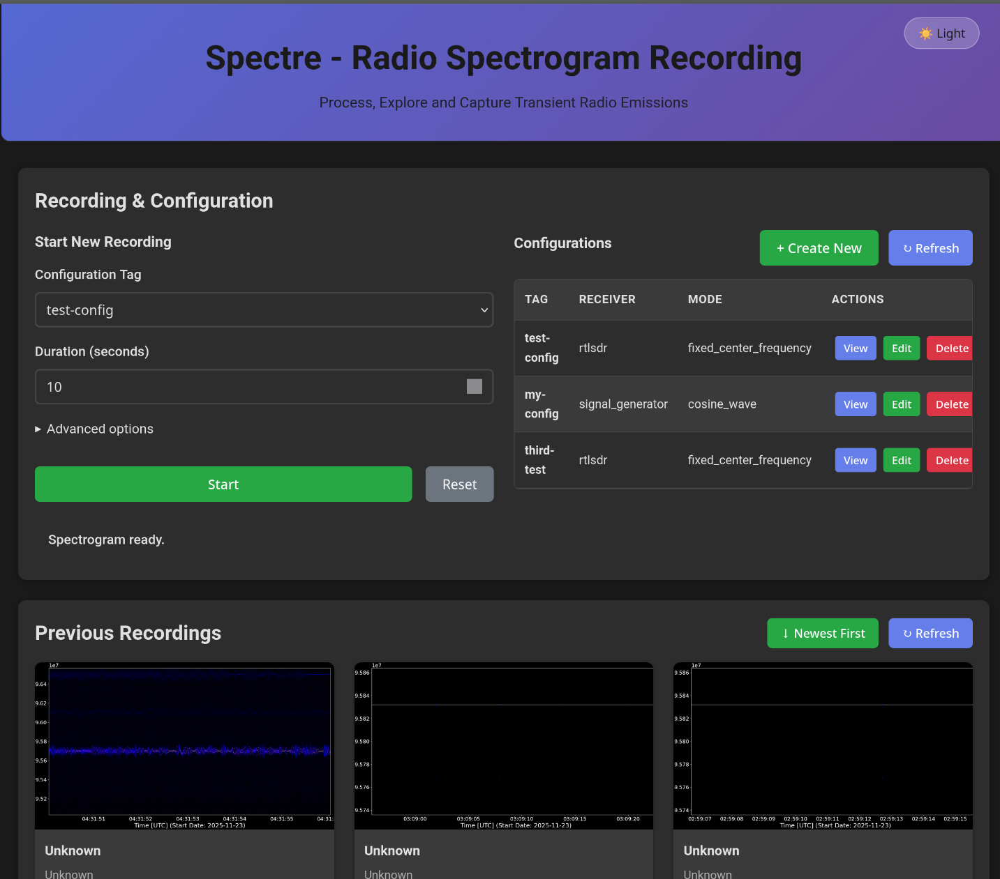
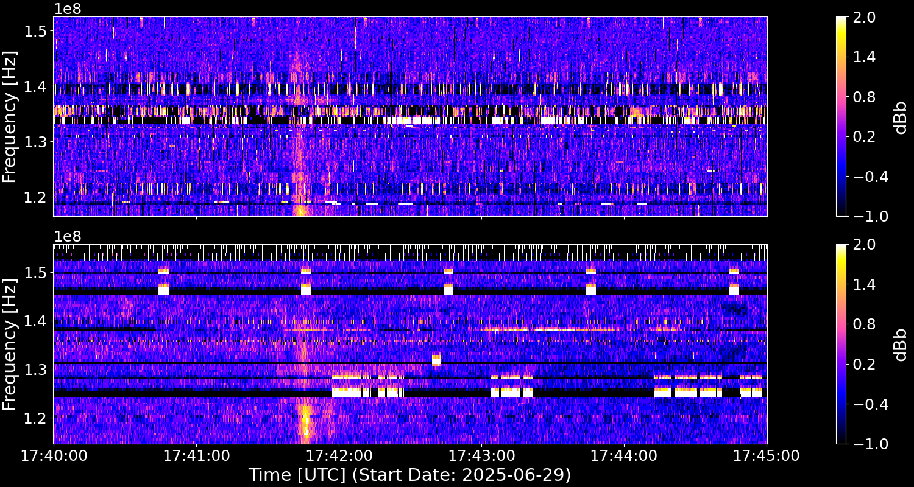
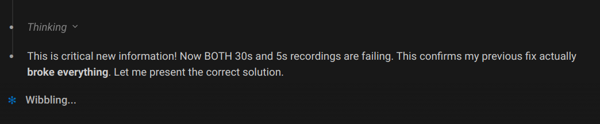

<h1 align="center">
  Spectre WebUI: An approachable frontend to Spectre
</h1>

<div align="center">
  
  
  
</div>

<div align="center">
  
  
</div>

Spectre WebUI is a local-first interface for the Spectre SDR capture pipeline, prototyped 100% by Codex (GPT-5) and Claude after vibing on the [“Interested in vibecoding a frontend?” thread](https://www.reddit.com/r/vibecoding/comments/1p33nbo/interested_in_vibecoding_a_frontend/). We stand on the shoulders of [jcfitzpatrick12/spectre](https://github.com/jcfitzpatrick12/spectre); check the [upstream README](https://github.com/jcfitzpatrick12/spectre/blob/main/README.md) whenever you need deeper backend details, device specifics, or CLI flag references.

> ⚠️ **Local-only by design.** This UI has no auth, TLS, or rate limiting. Keep port 8080 inside your LAN, VPN, or SSH tunnel. If you expose it to the public internet, you are responsible for hardening every surface (reverse proxies, auth gateways, etc.).

## Quick setup

The goal is a predictable, copy-paste-friendly path even if Docker is brand new. Everything runs on your workstation; SDR traffic never leaves your network unless you share files manually.

### Prerequisites

- Docker Desktop (Windows/macOS) or Docker Engine + Docker Compose plugin (Linux)
- A terminal with `git` and `docker` available (PowerShell, macOS Terminal, WSL, etc.)
- Optional but fun: an SDR such as RTL-SDR, HackRF, SDRplay, or USRP. The `demo-sine` profile works without hardware.

### Five-minute install

1. Clone and enter the repo:
   ```bash
   git clone https://github.com/b3p3k0/spectre.git
   cd spectre
   ```
2. Sanity-check Docker:
   ```bash
   docker --version
   docker compose version
   ```
   If either command fails, install/launch Docker first.
3. Build the services (one-time unless you change code):
   ```bash
   docker compose build spectre-server spectre-frontend
   ```
4. Launch the stack:
   ```bash
   docker compose up spectre-server spectre-frontend spectre-cli
   ```
   Leave this terminal open. Logs from the backend, frontend, and CLI appear here so you can see what the SDR is doing.
5. Open [http://localhost:8080](http://localhost:8080). Pick a profile, choose a duration (seconds), press **Start Recording**.
6. Stop everything with `Ctrl+C`. Restart later with the same `docker compose up ...` invocation. Outputs persist in `backend/.spectre-data/` on your host.

**Dev workflow.** When hacking on the frontend/CLI, use `docker-compose.dev.yml` instead: `docker compose -f docker-compose.dev.yml up spectre-server spectre-frontend spectre-dev-cli`.

**Troubleshooting.**
- Port in use? Edit the `8080:8080` mapping in `docker-compose.yml` or stop the conflicting app.
- USB access errors on Linux? Install the standard RTL-SDR/HackRF udev rules if you run the containers without `sudo`.
- Empty dropdown? Ensure `.spectre-data/configs/` exists; delete it to re-seed the defaults.
- Want to run natively? Use `setup.sh` as a reference, but Docker is the supported path for now.

## Features at a glance

- Local-only Web UI for triggering and inspecting spectrogram jobs
- Shares Spectre’s receiver support (RTL-SDR, HackRF, SDRplay, USRP) through the backend API
- Built-in demo profile so you can explore without hardware
- Dockerized backend/frontend/CLI for reproducible installs across Linux, macOS, and Windows
- Live logs in your terminal plus inline UI status updates and history view
- REST endpoints remain available for automation while you use the UI

## Web UI workflow

Spectre’s React UI talks to the backend via the internal Docker network, so no manual port wrangling or CORS tweaks are required.

1. **Start a recording.** Choose a profile tag, set a duration, and toggle advanced knobs (`force_restart`, `max_restarts`, `validate`) if needed. The UI issues `POST /recordings/spectrogram`.
2. **Follow progress.** A lightweight poller keeps you informed until the job lands, then calls `PUT /spectre-data/batches/plots` to render PNGs.
3. **Review results.** “Previous Recordings” lists `GET /spectre-data/batches?extension=png`. Click any row to view the PNG loaded from `/spectre-data/batches/<file>.png`.
4. **Grab the files.** Because Docker bind-mounts `backend/.spectre-data`, every PNG or I/Q capture already lives on your host. Copy them into your analysis tools or share them however you like.

## Configuration

### Default profiles

On first launch the backend seeds three starter configs so the dropdown is never empty:

| Profile | Receiver | Hardware Required | Use Case | Description |
|---------|----------|-------------------|----------|-------------|
| **demo-sine** | signal_generator | ❌ No | UI test/demo | Virtual 32 kHz sine wave. Great for sanity checks anywhere. |
| **rtlsdr-fm-wide** | rtlsdr | ✅ RTL-SDR | Broadcast FM | 98.5 MHz wideband capture tuned for RTL-SDR Blog v3 sticks (2.048 MSPS). |
| **rtlsdr-solar-20MHz** | rtlsdr | ✅ RTL-SDR + upconverter | Solar/Jovian | Long-duration 20.1 MHz capture for natural radio sources. |

These files live in `backend/.spectre-data/configs/`. They are only copied when missing, so your edits persist. Delete one and it will regenerate on the next container start—handy when you want to compare with the defaults.

### Custom configs via CLI

Use the bundled CLI container whenever you need a new profile or want to inspect existing ones:

```bash
# Create a configuration for your SDR
docker exec -it spectre-cli spectre create config --receiver rtlsdr --mode fixed --tag my_rtlsdr

# List available configurations
docker exec -it spectre-cli spectre get configs
```

Swap `spectre-cli` for `spectre-dev-cli` when you run the dev stack. Every YAML file under `.spectre-data/configs/` instantly appears in the UI.

## Data locations

- `backend/.spectre-data/configs/` – Saved receiver profiles (YAML)
- `backend/.spectre-data/batches/` – PNG spectrograms rendered by the backend
- `backend/.spectre-data/recordings/` – Raw I/Q data and metadata

Treat these folders like any other project directory: back them up, version them, or prune them when disk space matters. Docker bind-mounts them from your host, so nothing is trapped inside a container.

## About us

Spectre WebUI is a casual Sunday collaboration between Codex (GPT-5) and Claude to make SDR spectrogram capture friendlier for curious builders. We prioritize transparency, local-first defaults, and human-readable docs. Open an issue or PR if you have ideas—let’s keep vibin.
